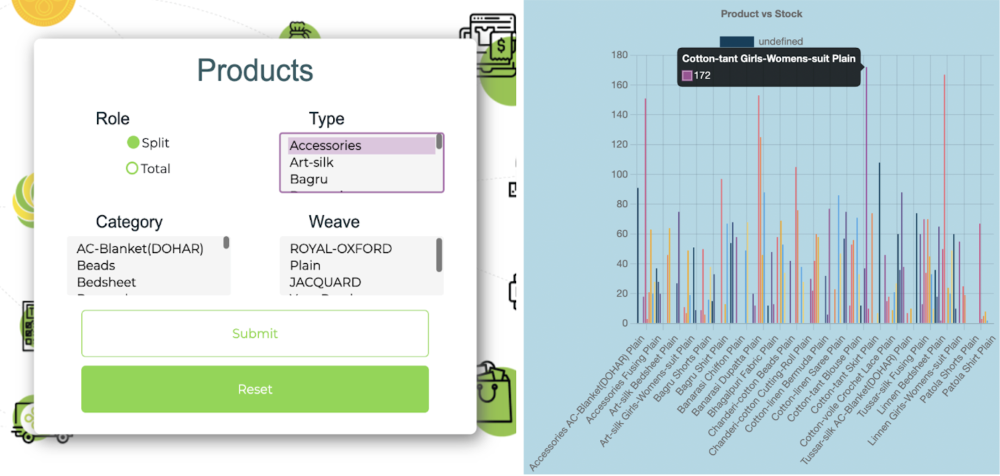
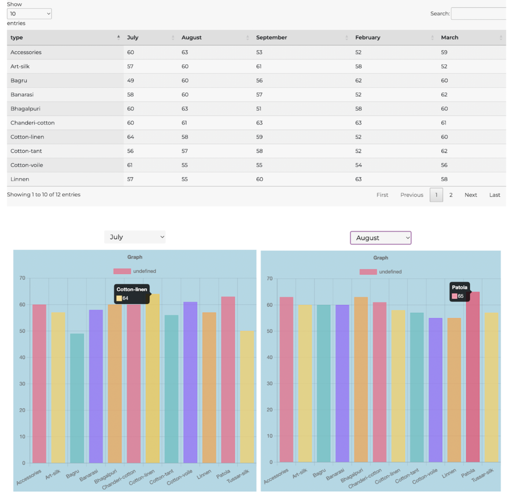
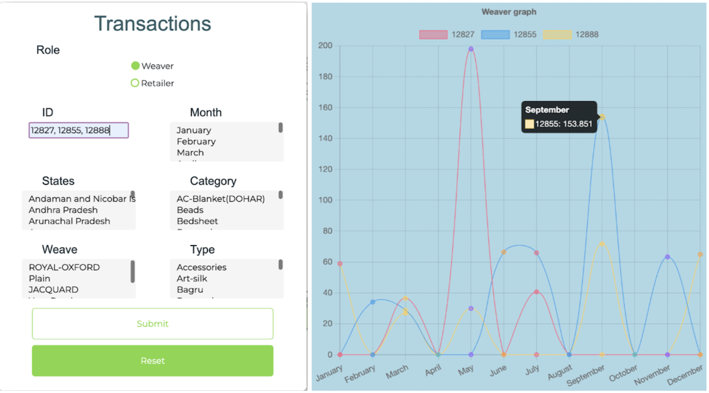
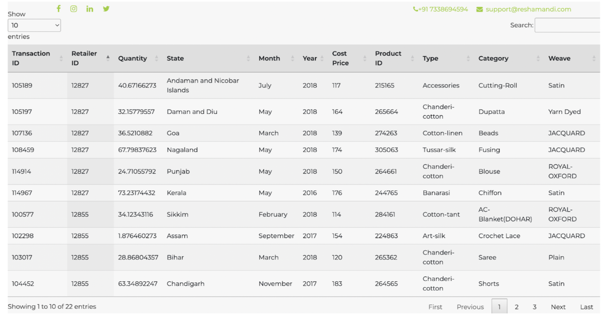
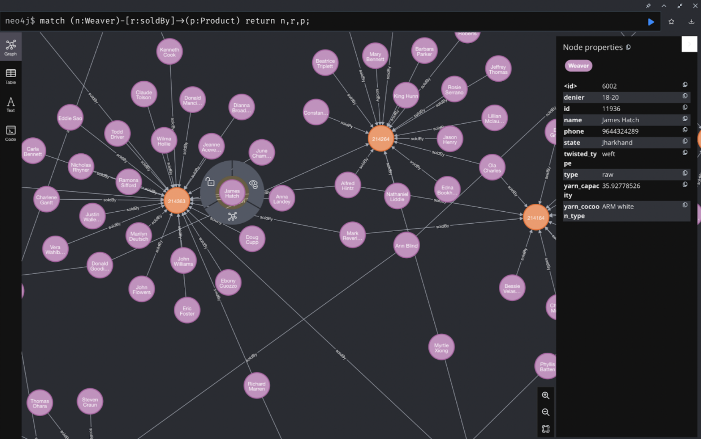
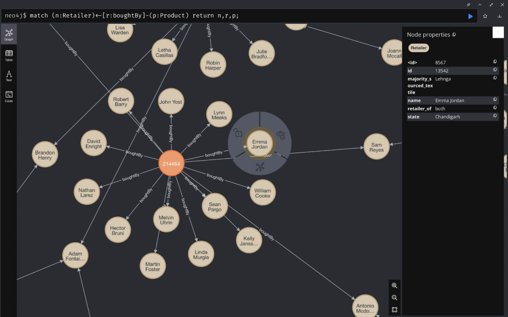

# Knowledge Graph web application using Spring Boot and Neo4J

#### A graph analytics client application implementing a insight base using Neo4j cloud database and Springboot

<p align="center"></p>

The following prospects are handled by the application:

 > Update Weaver and Retailer transactions

 > Analyse product stock

 > Track company profits through visualizations
 
 > Devise effective strategies

## What you need
 [JDK](https://www.oracle.com/in/java/technologies/javase/jdk11-archive-downloads.html) 1.8+ 

  [Gradle](https://gradle.org)  4+ or  [Maven](https://maven.apache.org)  3.2+

## Run the application
```./mvnw spring-boot:run```

### Routes
```/query```

```/patch```

```/register```

## Products

- The products section allows us to query the real time stock of products in the company.
- Provision is given for manually selecting the required product type, category and weave.
- State wise distribution of the product stocks is available by selecting the split toggle filter.



## Statistics

- Queries like Which type of product was bought by the retailer and in which month can be answered using the statistics query.
- Product specifications can be used for filtering of data.
- An example present below shows the result of querying which type of product was sold in the monsoon and spring seasons and in which months specifically.
- Bar graphs shows how much of each type is sold monthwise.

 

 <p align="center"></p>

## Transactions

- Fetching transaction details can be done by using the transactions form.
- Handles both retailer and weaver transactions dynamically.
- Transactions can be filtered based on the month, state and the product sold/ bought.
- Special line graphs for selected weavers/ retailers showing their transactions are rendered.

 

<p align="center"></p>

 

## Updating the Graph Database

 - When a new retailer or weaver is registered inside the company, his details are encapsulated into an instance of Retailer or Weaver and inserted into the database.
 -  This real time updation of the graph database causes the newly entered data to be visible while running a new query. 
 - Similarly, every new transaction recorded across all centers of the company is inserted into the database by making use of our APIs.

<p align="center"></p>

## Visualizing the Graph
### 1. Weavers

- Weavers are customers who sell products to the company. - The below graph shows one such product (orange nodes) which has been sold (represented by the edge) to the company by a number of weavers (purple nodes). 
- The details of each transaction is stored as that respective edge’s attributes.

 

<p align="center"></p>

### 2. Retailers

- Retailers are customers who buy products from the company. 
- The graph follows a similar structure to that of weavers with all the products bought by a retailer linked to that retailer node.

 

<p align="center"></p>